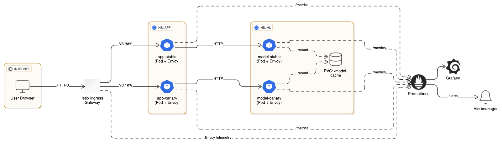
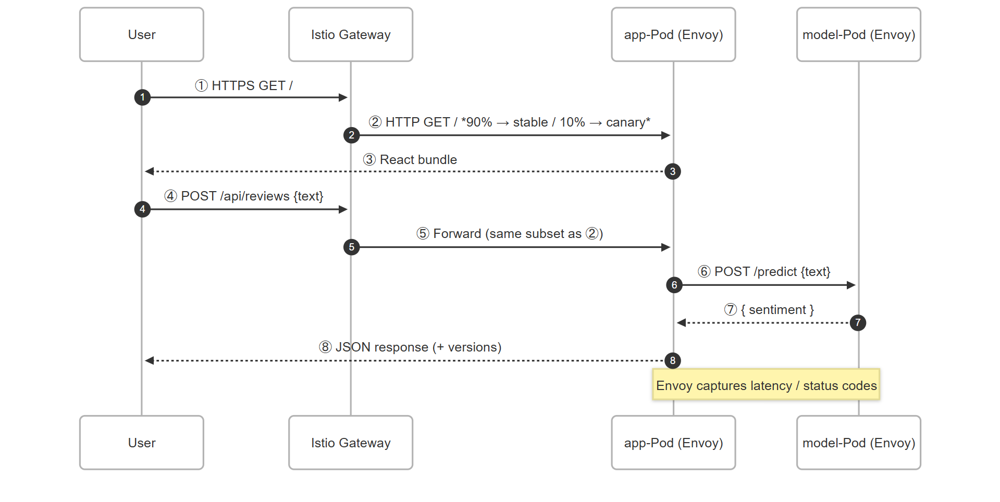
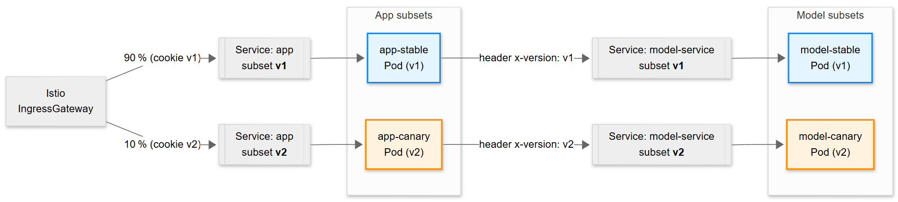
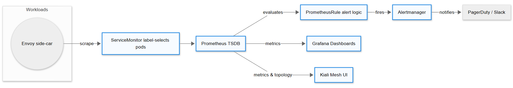

# Deployment & Data‑Flow Documentation – Restaurant‑Sentiment Platform

> **Purpose**  Give a **new teammate** an immediate grasp of:
>
> - **Deployment Structure** – every component running in Kubernetes/Istio and how they connect.
> - **Data Flow** – how user traffic, inter‑service calls, metrics, and alerts move through the system (incl. 90/10 canary split).

---

## Table of contents

1. [Deployment Structure](#1-deployment-structure)

   1. [High‑level component map](#11-high%E2%80%91level-component-map)
   2. [Mesh topology diagram](#12-mesh-topology-diagram)
   <!-- 3. [Resource inventory](#13-resource-inventory) -->

2. [Data Flow](#2-data-flow)

   1. [User‑request sequence](#21-user%E2%80%91request-sequence)
   2. [Dynamic routing (90/10 canary)](#22-dynamic-routing-9010-canary)
   3. [Control‑plane & observability](#23-control%E2%80%91plane--observability)

<!-- 3. [Reading guide](#3-reading-guide) -->

---

## 1  Deployment Structure

### 1.1  High‑level component map

| Layer                   | Runtime Artefact                              | Key K8s Resources                                                                              | Purpose / Notes                                                                                            |
| ----------------------- | --------------------------------------------- | ---------------------------------------------------------------------------------------------- | ---------------------------------------------------------------------------------------------------------- |
| **Ingress Edge**        | Istio IngressGateway (`istio‑ingressgateway`) | `Deployment`, `Service/LoadBalancer`, **Gateway** CRD                                          | Single public endpoint (`TLS :443`) that injects traffic into the mesh.                                    |
| **UI + API**            | `app-main` image                              | `Deployment` ×2 _(stable / canary)_, **Service**, **VirtualService**, **DestinationRule**, HPA | React SPA + Flask API. Receives 90 % / 10 % traffic split for experiment.                                  |
| **Model service**       | `model-service` image                         | `Deployment` ×2, **Service**, **DestinationRule**, HPA                                         | FastAPI wrapper around scikit‑learn sentiment classifier. Mirrors the UI split to stay version‑consistent. |
| **Observability stack** | Prometheus, Alertmanager, Grafana, Kiali      | `StatefulSet`, `Deployment`, **ServiceMonitor**, **PrometheusRule**, Ingress, ConfigMaps       | Metrics collection, alerting, dashboards, and mesh topology explorer.                                      |
| **Mesh control‑plane**  | Istiod                                        | `Deployment` in `istio-system`                                                                 | Side‑car injection, service discovery, policy enforcement.                                                 |
| **Support**             | Config, Secrets, PVC                          | `ConfigMap` (feature flags), `Secret` (DB creds), `PVC` (model cache)                          | Runtime configuration & storage.                                                                           |

### 1.2  Mesh topology diagram



---

## 2  Data Flow

### 2.1  User‑request sequence



### 2.2  Dynamic routing (90/10 canary)



**Routing flow explained**

1. **IngressGateway** consults _VirtualService `app-vs`_ to weight traffic **90 % to subset v1, 10 % to subset v2**. Sticky sessions use `cookie:user-id`.
2. Each **app Pod** propagates a custom header `x-version` so the downstream _DestinationRule `model-dr`_ routes to the matching model subset – ensuring **stable ↔ stable** and **canary ↔ canary** coupling.
3. Rollback or progressive promotion just requires editing weights in the VirtualService (or via Argo Rollouts), no image rebuilds.

### 2.3  Control‑plane & observability



**Flow breakdown**

1. **Envoy side‑cars** expose standard Istio `/stats/prometheus` and custom app counters on each Pod.
2. **ServiceMonitor** objects (one per namespace) instruct Prometheus _what_ to scrape and _how often_ (15 s).
3. **Prometheus** writes raw metrics to its TSDB and evaluates **PrometheusRule** expressions every 30 s.
4. On a rule breach, **Alertmanager** de‑duplicates / silences and routes alerts to **PagerDuty & Slack**.
5. **Grafana** queries Prometheus directly for live dashboards (P95 latency, error budget, business KPIs).
6. **Kiali** pulls metric aggregates + Envoy telemetry to render the real‑time service graph and health badges.

**Sample alert**

```yaml
after canary_latency_p95 > 400ms for 5m: page("SLO breach: latency p95 > 400ms (canary)")
```

Once an alert fires, Argo Rollouts (webhook receiver) may automatically scale the _canary_ Deployment to 0, while the on‑call engineer inspects Grafana & Kiali to confirm.
